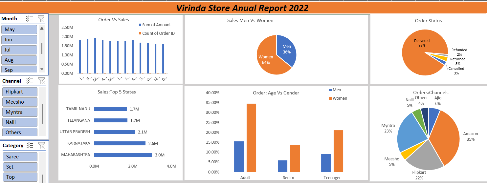

# Vrinda Store Sales Analysis (Excel Data Analytics Project)

This project analyzes **Vrinda Store sales data for the year 2022** using Microsoft Excel.  
The objective of this project is to understand customer behavior, identify sales trends, and generate insights that can help improve sales in the coming year.

---

## Project Objective

Vrinda Store wants to create an **Annual Sales Report for 2022** so that they can better understand their customers and improve business strategies for 2023.

---

## Tools Used

- Microsoft Excel
- Data Cleaning
- Pivot Tables
- Pivot Charts
- Interactive Dashboard
- Data Visualization

---

## Business Questions

The following business questions were analyzed:

- Compare **Sales vs Orders using a single chart**
- Identify the **month with highest sales and orders**
- Determine whether **men or women purchased more in 2022**
- Analyze **different order statuses**
- Identify the **top 10 states contributing to sales**
- Understand the **relation between age group and gender**
- Identify which **sales channel contributes the most revenue**
- Determine the **highest selling category**

---

## Key Insights

- **Women customers contributed around 65% of total sales**
- **Adult age group (30–49 years)** contributed the highest number of orders (~50%)
- **Maharashtra, Karnataka and Uttar Pradesh** are the top contributing states (~35% of sales)
- **Amazon, Flipkart and Myntra** are the major sales channels (~80% contribution)

---

## Business Recommendation

Based on the analysis, Vrinda Store should focus marketing efforts on:

- **Women customers aged 30–49**
- Customers located in **Maharashtra, Karnataka and Uttar Pradesh**
- Promotions and offers through **Amazon, Flipkart and Myntra**

Targeted campaigns and discounts on these platforms could help increase sales in 2023.

---

## Dashboard Preview

---

## Project Files

- `Vrinda Store Data Analysis_.xlsx` → Excel dashboard and analysis
- `dashboard_preview.png` → Dashboard screenshot

---

## Author

**Tejas R**  
Data Analytics | SQL | Power BI | Excel | Python
